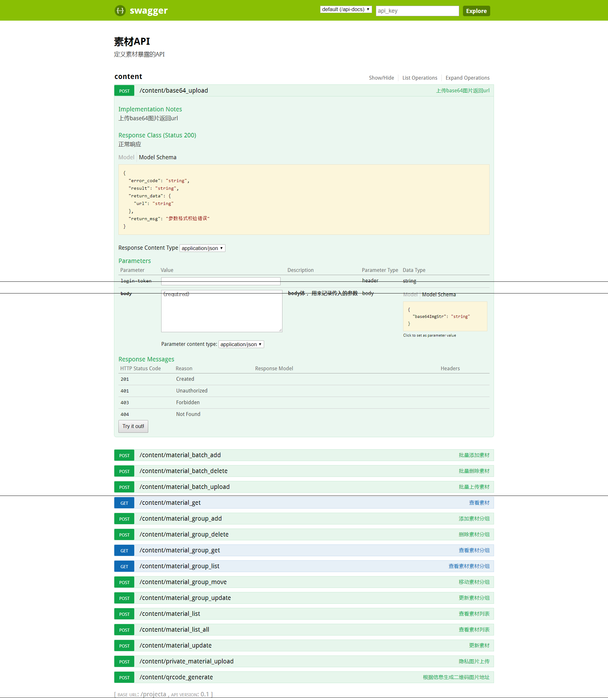

You can view the api documentation in swagger-ui by pointing to  
http://localhost:8085/projecta

Change default port value in application.properties

- Added HTTP auth header to support login-token into the controller.

- you can see that from UI page
- Key part is in the configuration class